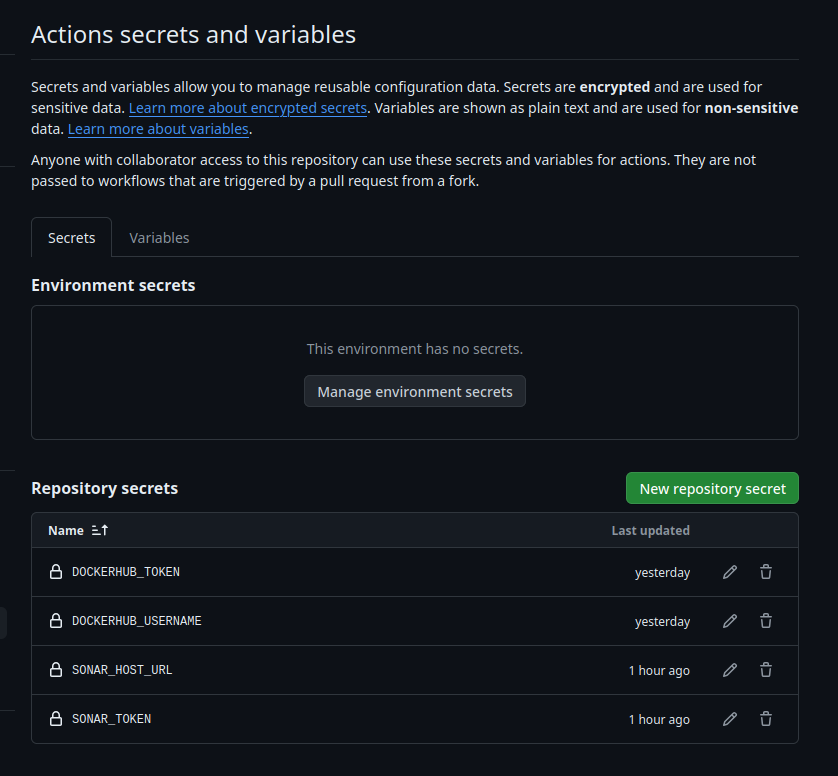

# Deployment-Using-Github-Actions

## Step 1
Setup Terraform and configure aws on your local machine
## Step 2
Building a simple Infrastructure from code using terraform
```bash
cd Instance-terraform
terraform init 
terraform apply --auto-approve
```
## Step 3
### a. IAM Role for EC2
### b. Setup github actions with ec2


## Step 4
setup sonarqube and dockerhub for github actions


## Step 5
Elastic kubernetes service or Eks cluster setup
```bash
cd deployment-using-github-actions/Eks-terraform
terraform init
terraform apply
```
## Step 6 
commit the changes and this will deploy the image on EKS


## Step 7
[Using this repo to Monitering via Prmotheus and grafana](https://github.com/Omar-Ahmed-Dt/Monitoring_AWS_EKS_using_Prometheus_and_Grafana)

